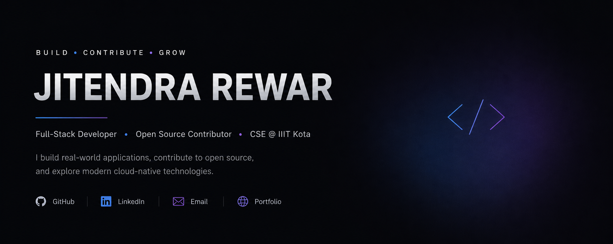

<div align="center">
  
  <p align="center">
  <a href="https://www.linkedin.com/in/jitendra-rewar-495326369">LinkedIn</a> •
  <a href="https://github.com/JituRewar">Portfolio</a> •
  <a href="mailto:jiturewar9@gmail.com">Email</a>
</p>
</div>

<div align="center">

# 👋 Hey, I'm Jitendra Rewar

### 💻 Computer Science Undergraduate @ IIIT Kota

<p>
  
</p>

<p>
  
  
</p>

</div>

---

## 👋 About Me

I'm a **Computer Science undergraduate at IIIT Kota** who enjoys building real-world applications, contributing to open source, and exploring modern software technologies.

I like turning ideas into products, solving problems with **C++ & DSA**, and learning by working on real-world codebases.

```text
💻 Build things
🌎 Contribute to Open Source
🧠 Solve problems
☁️ Explore Cloud Native
🚀 Keep Learning
```

---

## 🚀 Currently Building

<div align="center">

### 🎫 Conveo

**A modern event management platform**

Create events → Generate QR Tickets → Manage Attendance → Analyze Events → Handle Waitlists

`Next.js` `TypeScript` `PostgreSQL` `Prisma`

🚧 **Currently Building**

<br/>

### 🌎 Open Source

Contributing to and learning from real-world open-source projects.

`CircuitVerse` `Apicurio Registry` `CNCF Ecosystem`

🌱 **Building · Contributing · Learning**

</div>

---

## 🛠️ Tech Stack

### 💻 Languages

<p>

</p>

### 🎨 Frontend

<p>

</p>

### ⚙️ Backend & Database

<p>

</p>

### ☁️ DevOps & Tools

<p>

</p>

---

## ⭐ Featured Projects

### 🎫 Conveo

> Event management platform with QR tickets, attendance tracking, analytics and waitlists.

**Stack**

`Next.js` `TypeScript` `PostgreSQL` `Prisma`

🚧 **In Development**

---

### 🎥 VideoHub

> Full-stack video-sharing platform with authentication, uploads, cloud storage and REST APIs.

**Stack**

`React` `Node.js` `Express` `MongoDB`

🔗 **Repository**

---

### 👕 OldHobby

> College-focused merchandise platform created for customized IIIT Kota products.

**Stack**

`Next.js` `React` `Tailwind` `Vercel`

🌐 **Live Project**

---

### 💰 Collaborative Budget Splitter

> Real-time application for managing shared expenses and collaborative budgets.

**Stack**

`Next.js` `TypeScript` `WebSockets`

🚧 **Building**

---

<div align="center">

### 🚀 More Projects

<a href="https://github.com/JituRewar?tab=repositories">
  
</a>

</div>

---

## 🌎 Open Source

I enjoy understanding large codebases, solving real-world issues, and collaborating with maintainers and developers.

### 🔧 CircuitVerse

Contributing to an open-source **digital circuit simulation platform**, working with real-world frontend and application code.

### 🧩 Apicurio Registry

Contributing **UI improvements, bug fixes and developer tooling** to a CNCF ecosystem project.

### ☁️ CNCF Ecosystem

Exploring cloud-native projects and contributing to real-world codebases involving modern infrastructure and developer tooling.

### 🤝 Open Source

Learning through:

`Issues` → `Pull Requests` → `Reviews` → `Collaboration` → `Contributions`

<div align="center">

> **Build · Contribute · Review · Collaborate · Learn**

</div>

---

## 🧠 Problem Solving

I regularly practice **Data Structures & Algorithms using C++**.

<div align="center">

| 📚 Topic           | 🧩 Topics I Practice                          |
| ------------------ | --------------------------------------------- |
| 🔢 Arrays          | Strings · Hashing · Prefix Sum                |
| 🔍 Searching       | Binary Search · Two Pointers · Sliding Window |
| 🔁 Recursion       | Backtracking · Divide & Conquer               |
| 🔗 Data Structures | Linked Lists · Stacks · Queues                |
| 🌳 Trees           | BST · Binary Trees · Traversals               |
| 🕸️ Graphs         | BFS · DFS · Shortest Path · DAG               |
| 🧠 Algorithms      | Greedy · Dynamic Programming                  |
| ⚡ Core             | Bit Manipulation · Sorting                    |

</div>

---

## 📊 GitHub Activity

<div align="center">


<br/>


<br/>


</div>

---

## 🐍 Contribution Activity

<div align="center">


</div>

---

## 🛣️ Developer Journey

```text
2025
│
├── 🎓 Started B.Tech CSE @ IIIT Kota
│
├── 💻 Started Full-Stack Development
│
└── 🌐 Learned React, Node.js & MongoDB
        │
        ▼
2026
│
├── 🚀 Built Full-Stack Applications
│
├── 🌎 Started Contributing Actively to Open Source
│
├── 🔧 Contributed to CircuitVerse & Apicurio Registry
│
├── 🧠 Focused on DSA & Software Engineering
│
├── ⚡ Started Exploring Next.js & TypeScript
│
├── 🗄️ Exploring PostgreSQL & Backend Architecture
│
└── 🚀 Building · Contributing · Learning
```

---

## 🎯 2026 Goals

<div align="center">

|        🚀 Build       |         🌎 Contribute        |      🧠 Improve     |  ☁️ Explore  |
| :-------------------: | :--------------------------: | :-----------------: | :----------: |
| Production-ready apps | Meaningful OSS contributions | DSA & System Design | Cloud Native |
|   Ship more products  |     Work with maintainers    | Strong fundamentals |  Kubernetes  |

</div>

---

## ⚡ What I'm Focusing On

```text
                    ┌─────────────────────┐
                    │     BUILDING 🚀     │
                    └──────────┬──────────┘
                               │
             ┌─────────────────┼─────────────────┐
             ▼                 ▼                 ▼
       Full Stack         Open Source        DSA / C++
             │                 │                 │
             ▼                 ▼                 ▼
         Next.js          CircuitVerse       Algorithms
        TypeScript       Apicurio Registry      DP
       PostgreSQL        CNCF Ecosystem       Graphs
             │                 │                 │
             └─────────────────┼─────────────────┘
                               ▼
                    ┌─────────────────────┐
                    │   KEEP LEARNING 🌱  │
                    └─────────────────────┘
```

---

## 📫 Let's Connect

I'm always open to discussing:

`Open Source` · `Development` · `Projects` · `Internships` · `Collaboration` · `Interesting Ideas`

<div align="center">

<a href="https://github.com/JituRewar">

</a>

<a href="https://www.linkedin.com/in/jitendra-rewar/">

</a>

</div>

<br/>

<div align="center">

### ⭐ Thanks for visiting!


<br/>

**Build · Contribute · Learn · Ship**

</div>
